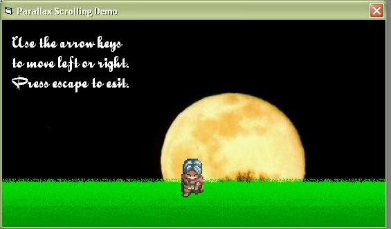



## Parallax Scrolling

### Description

A first for PSC (I think) - A "how-to" on parallax scrolling. Demonstrates an animation technique used by some RPGs and side-scrolling platform games that creates a better sense of motion. Enjoy!
 
### More Info
 

             |
---                |---
**Submitted On**   |2006-01-16 09:08:44
**By**             |[Brian Matthew Anderson](https://github.com/Planet-Source-Code/PSCIndex/blob/master/ByAuthor/brian-matthew-anderson.md)
**Level**          |Intermediate
**User Rating**    |5.0 (15 globes from 3 users)
**Compatibility**  |VB 5\.0, VB 6\.0
**Category**       |[Games](https://github.com/Planet-Source-Code/PSCIndex/blob/master/ByCategory/games__1-38.md)
**World**          |[Visual Basic](https://github.com/Planet-Source-Code/PSCIndex/blob/master/ByWorld/visual-basic.md)
**Archive File**   |[Parallax\_S1965681162006\.zip](https://github.com/Planet-Source-Code/brian-matthew-anderson-parallax-scrolling__1-63962/archive/master.zip)

### API Declarations

Bitblt, GetTickCount

